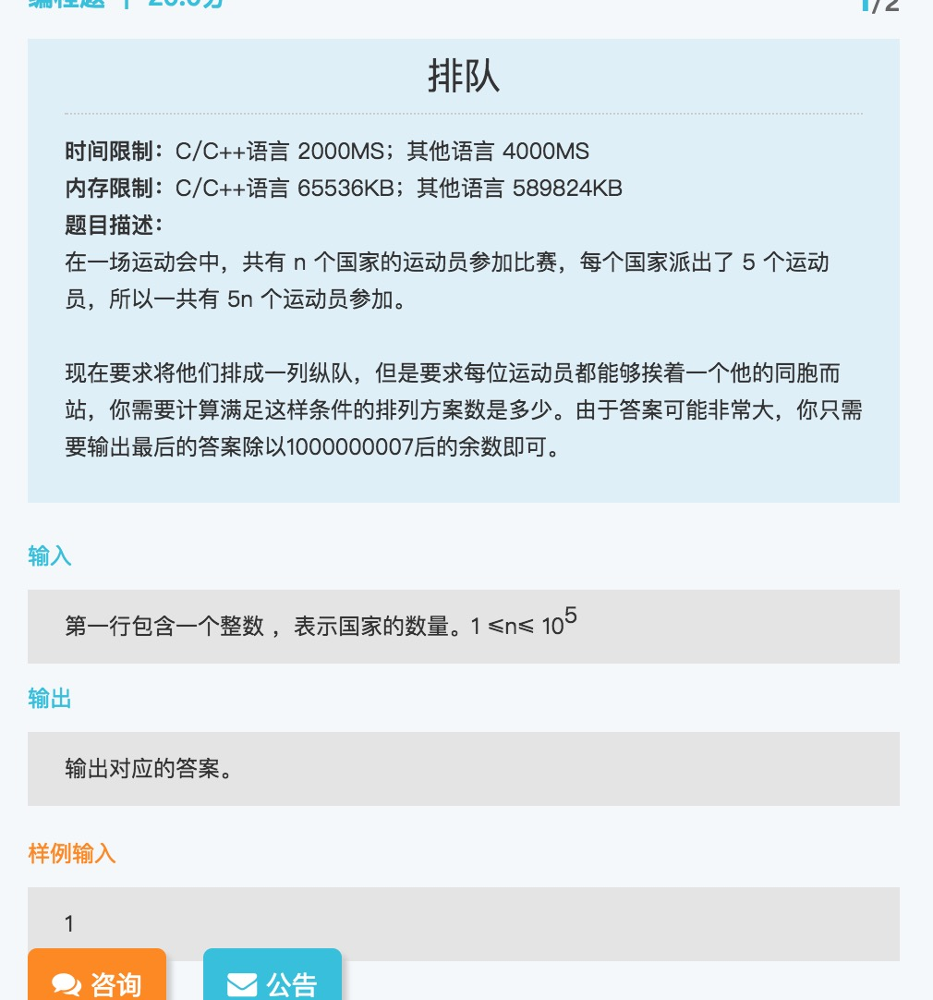
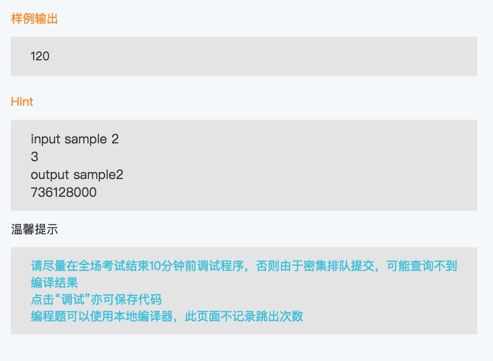

## 排队问题

思路  
可以考虑将问题拆分成子问题：
- 正好0个国家被分开，这种情况就是n!，所有国家都没被分开，记录为d(0)
- 正好1个国家被分开，考虑是否可以由 (n+1)! 和 d(0) 计算而来
- ···
- 正好n个国家被分开，同理，一步一步计算

最后总的数量就是 d(0)+···+d(n)

n=1 1*120
n=2 14*120^2
n=3 736128000=426*120^3